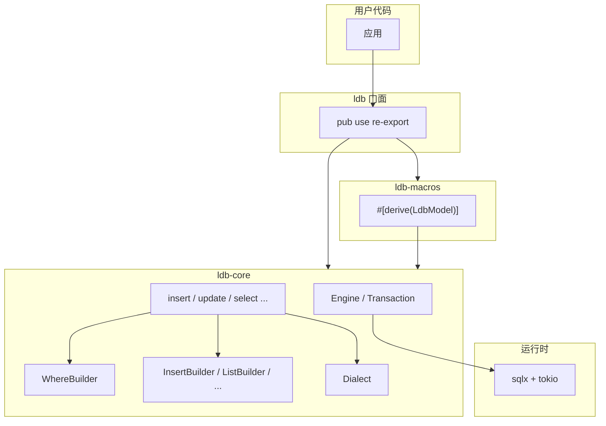
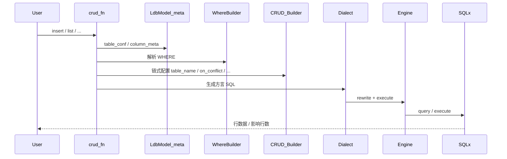

# 架构

> **状态**：描述目标实现思路；用户 API 以 [api.md](api.md) 为准。

## Workspace 分层

| Crate | 职责 |
|-------|------|
| `ldb` | 用户唯一依赖；re-export `ldb-core` 与 `ldb-macros` |
| `ldb-core` | 连接、引擎、CRUD Builder、条件构建、方言、错误 |
| `ldb-macros` | 编译期派生 `LdbModel`；运行时元数据逻辑在 `ldb-core` |

## 请求链路

一次 CRUD 调用的大致路径：

## 设计约束

| 约束 | 说明 |
|------|------|
| 动态 SQL | 运行时拼装，使用 `sqlx::query()`，不用 `query!()` |
| 可空字段 | 模型字段用 `Option<T>`；`None` 在 Insert/Update 时忽略 |
| 集合命名 | 列表字段用 `_list` 后缀，如 `primary_key_column_name_list` |
| CRUD API | 入口函数 + Builder 链式 + `.await`，不用 `*Options` 结构体 |
| 术语 | 表配置用 `TableConf`；列映射用 `#[db(column = "...")]` |
| 方言 | 内部统一 `?` 占位符，执行前由 `Dialect` 改写为 `?` 或 `$n` |

## 方言（内部）

`Dialect` trait 对用户不可见，由 `MysqlEngine` / `PgEngine` 内部持有：

- `escape_identifier`：MySQL 反引号 / PG 双引号
- `rewrite_exec` / `rewrite_query`：占位符编号
- `upsert_clause`：MySQL `ON DUPLICATE KEY UPDATE` / PG `ON CONFLICT`

`MysqlVersion` 影响 upsert 语法与自增主键回填（`LAST_INSERT_ID` 等）。

## 与当前骨架的差异

当前 `ldb-core` 仍为占位实现，与目标 API 的主要差异：

| 当前骨架 | 目标 |
|----------|------|
| `ExtraContext` / `e()` | 删除；改为 CRUD Builder 链式 API |
| `Engine::commit` / `rollback` 在 trait 上 | 移到 `Transaction` |
| CRUD 函数未导出 | 在 `ldb-core` 实现，`ldb` re-export |
| `#[derive(LdbModel)]` 为 `compile_error!` | 宏生成 `LdbModel` trait |

实现时以 [api.md](api.md) 为准，按 [roadmap.md](roadmap.md) 分阶段对齐。
